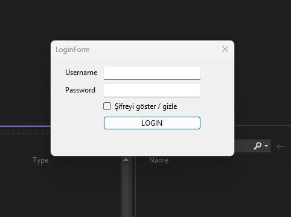
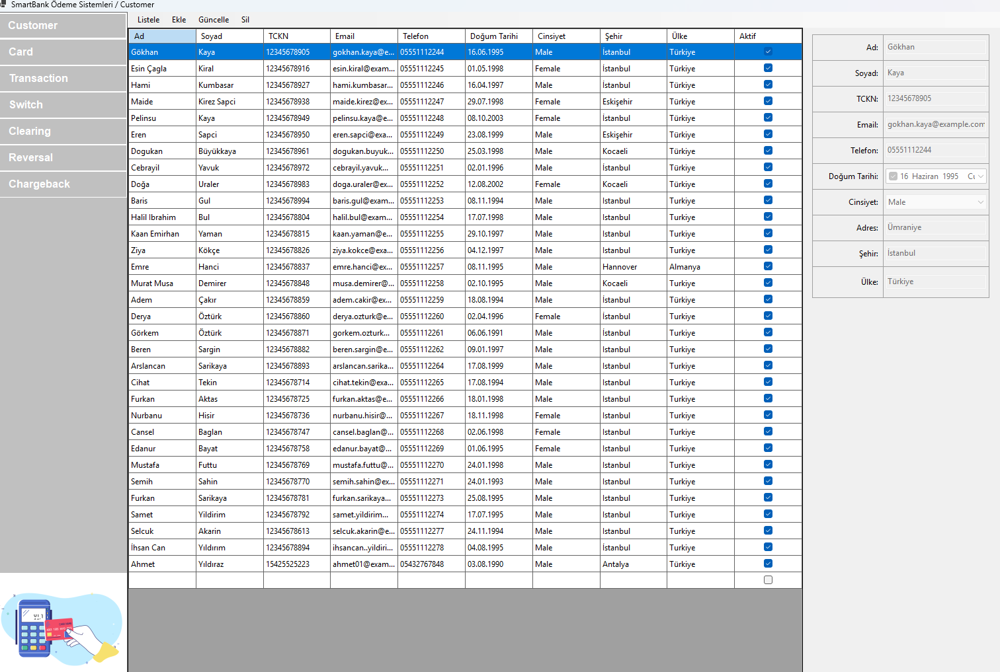
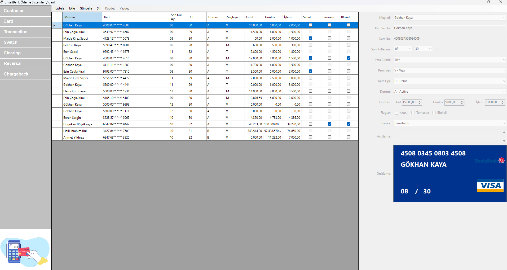
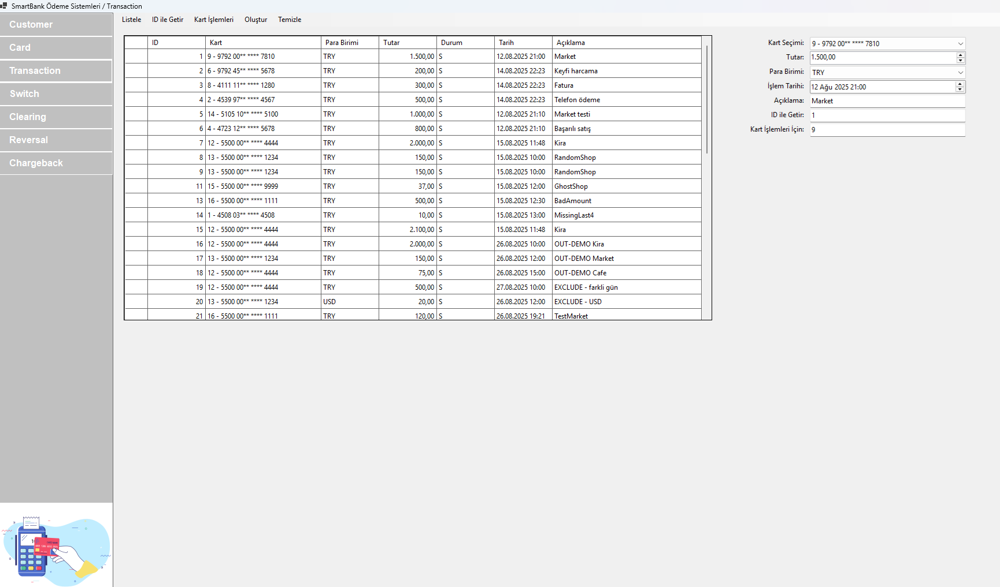
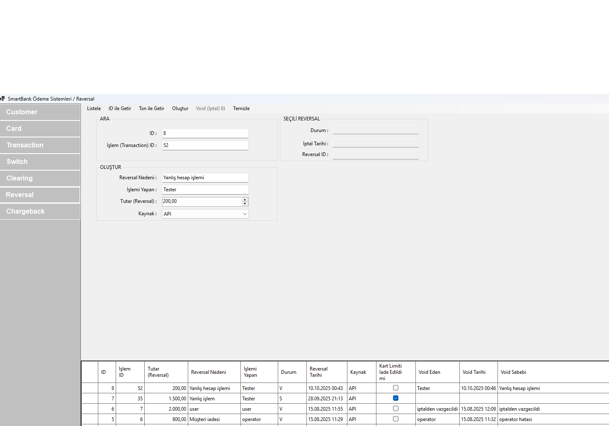
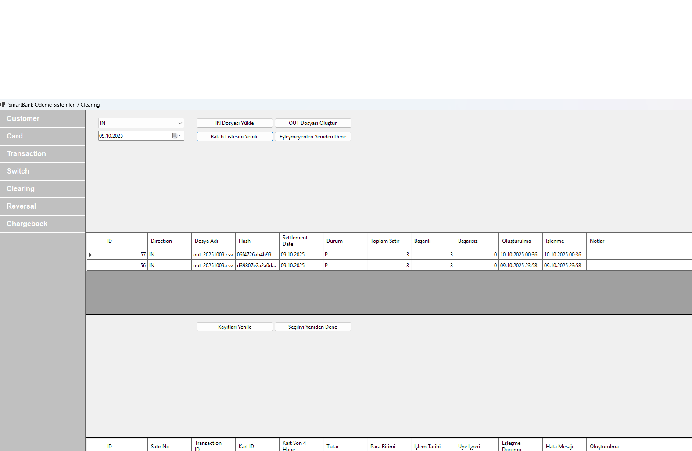
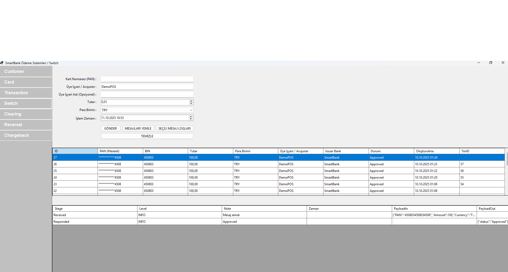
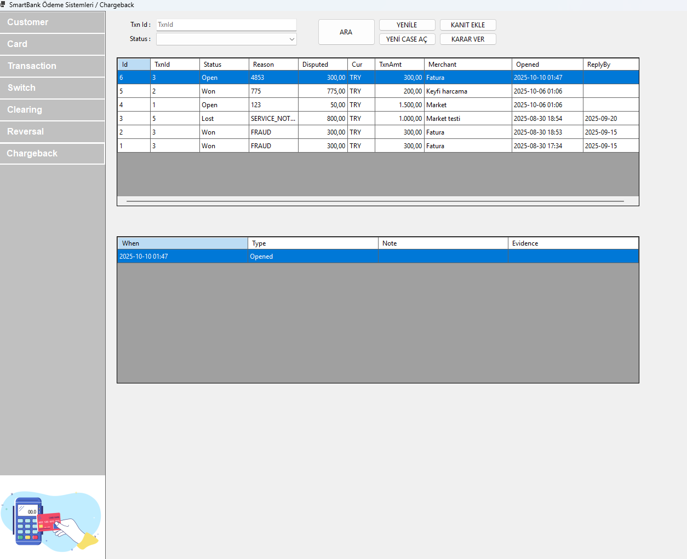

# 💳 SmartBank

SmartBank, **ASP.NET Core 8** ile geliştirilmiş, **katmanlı mimariye sahip bir ödeme sistemleri simülasyon platformudur.**  
Proje; kart, müşteri, işlem, reversal, takas, switch ve chargeback modüllerini içerir ve **gerçek bankacılık akışlarını örneklemek** üzere tasarlanmıştır.

---

## 🧩 Katmanlar
- **SmartBank.Api** → REST API katmanı (.NET 8)
- **SmartBank.Application** → İş kuralları, DTO’lar, servis yapısı
- **SmartBank.Infrastructure** → Veritabanı erişimi (EF Core), repository pattern
- **SmartBank.Domain** → Entity sınıfları ve temel domain modelleri
- **SmartBank.Desktop** → WinForms tabanlı masaüstü yönetim ekranları

---

## ⚙️ Kullanılan Teknolojiler
- **.NET 8**
- **Entity Framework Core**
- **AutoMapper**
- **FluentValidation**
- **JWT Authentication**
- **Swagger (API dokümantasyonu)**
- **DevExpress / DataGridView (UI)**

---

## 💼 Modüller ve Kısa Açıklamaları
| Modül | Açıklama |
|--------|-----------|
| **Customer** | Müşteri yönetimi ve kimlik doğrulama işlemleri |
| **Card** | Kart oluşturma, limit yönetimi ve kart durumları |
| **Transaction** | Kartlı işlemlerin kayıt ve yönetimi |
| **Reversal** | Hatalı işlemlerin geri alınması |
| **Clearing (Takas)** | Gün sonu mutabakat ve dosya eşleştirme süreçleri |
| **Switch** | POS–banka arası iletişim ve yönlendirme akışları |
| **Chargeback** | İtiraz ve geri ödeme işlemlerinin yönetimi |

---

## 📸 Ekran Görüntüleri
  
- **Login / Ana Menü**  
- **CustomerView** (Müşteri listesi + ekleme ekranı)  
- **CardView** (Kart tanımlama + limit yönetimi)  
- **TransactionView** (İşlem oluşturma ve görüntüleme)
- **ReversalView** (İşlem geri alma)
- **ClearingView** (IN/OUT dosyası yükleme ve eşleşme sonuçları)
- **SwitchView** (POS yönlendirme akışı)
- **ChargebackView** (İtiraz ekranı ve log detayları)
 

## 📸 Ekran Görüntüleri

### Login / Ana Menü

### CustomerView (Müşteri listesi + ekleme ekranı)

Video Linki: https://youtu.be/IPk7PgP_6SE

### CardView (Kart tanımlama + limit yönetimi)

Video Linki: https://youtu.be/0RutypJlmXI

### TransactionView (İşlem oluşturma ekranı)

Video Linki: https://youtu.be/aa1LaFIvAkM

### ReversalView (İşlem geri alma)

Video Linki: https://youtu.be/LIVLVQ-6TQI

### ClearingView (IN/OUT dosyası eşleşmeleri)

Video Linki: https://youtu.be/mYnOOTaaRA4

### SwitchView (POS yönlendirme akışı)

Video Linki: https://studio.youtube.com/video/hQuz4-kvvxA/edit

### ChargebackView (İtiraz ekranı)

Video Linki: https://youtu.be/JCJXURkaX00

